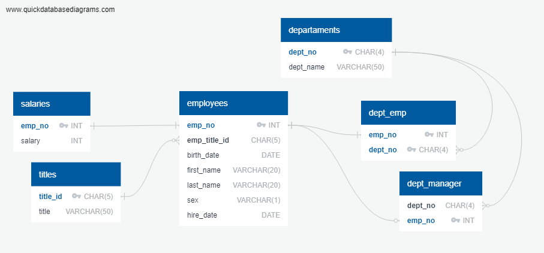
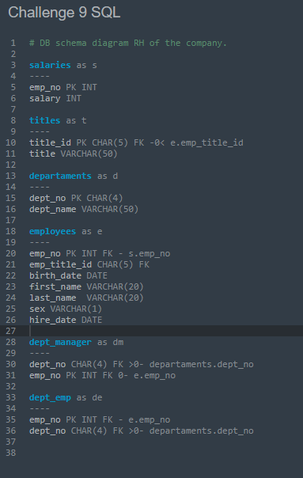

# SQL CHALLENGE

## Challenge number 9 
---

**This repository contains the following:**

A folder called  <mark>EmployeeSQL</mark>  where you will find the sql files for the queries organized as follows:

- Review_csvfiles.csv   with queries to check if the databases have duplicates.
- ERD_Schema_final.csv   with the file that contains the schemata for the Database.
- Drop_tables.csv  with the query to drop the tables in case they exist.
- Data_analysis.csv  with the queries that deliver answers to the questions of the challenge

A subfolder called <mark>data</mark>  that contains the csv files necesary for the analysis.

A subfolder called <mark>Images</mark>  with the images of the ERD

A subfolder called <mark>Results</mark>  that gathers the csv files with the answers to the questions of the Data Analysis

---
---
## First part

After cheking for connections the diagram for the project is presented her:

 

The tables are almost all connected by the employee number, which is a natural key for this type of databases. The only exception are the titles and departament tables that use other ids.

The ERD code is displayed here:

 

## Second part
The schemata for the Database can be found in the following link:

[Schemata SQL](./EmployeeSQL/ERD_Schema_final.sql)

Note: QuickDatabase assigns NOT NULL values to all the fields that were mantained when exported to SQL.
   

## Third part

1. There are 300,024 employees working for this company. the complete list can be seen in: 
[Answer 1 Csv](./EmployeeSQL/Results/Question1.csv). 

2. During 1986 the company hired 36,150 workers . The results can be found in: [Answer 2 Csv](./EmployeeSQL/Results/Question2.csv).

3. There are 24 managers in the company. Complete list: [Answer 3 Csv](./EmployeeSQL/Results/Question3.csv).

4. There are 331,603 records of employees. This number is bigger than the current number of employees due to the workers serving two different departaments. The answer for the challenge is here:  [Answer 4 Csv](./EmployeeSQL/Results/Question4.csv).  Additionally you can find a list of all the employees working for two different departaments here:    [Employees working for two areas by emp_no](./EmployeeSQL/Results/dept_emp_duplicates.csv)

5. Twenty persons share the name Hercules and have a last name beginning with B. Their names are listed here : [Answer 5 Csv](./EmployeeSQL/Results/Question5.csv). 

6. The Sales Departament has 52,245 employees working in it. The list can be found in: [Answer 6 Csv](./EmployeeSQL/Results/Question6.csv).

7. Sales and Development areas account for almost half the company with 137,952 employees in both departaments. For a complete list of people see:  [Answer 7 Csv](./EmployeeSQL/Results/Question7.csv).

8. We can found 1,638 last names belonging to the workers in the company. From these Baba is the most common last name (with 226 occurrences), while Foolsday is the least common, with just one occurence. The complete answer can be found here: [Answer 8 Csv](./EmployeeSQL/Results/Question8.csv).

**The files used for running the queries is found in this link :**

[Data Analysis Queries](./EmployeeSQL/Data_analysis.sql)

