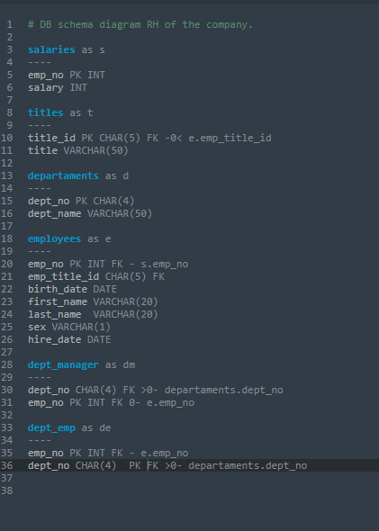

# SQL CHALLENGE

## Challenge number 9 
---

**This repository contains the following:**

A folder called  <mark>EmployeeSQL</mark>  where you will find the sql files for the queries organized as follows:

- Review_csvfiles.csv   with queries to check the databases are reliable.
- ERD_Schema_final.csv   with the file that contains the schemata for the Database.
- Drop_tables.csv  with the query to drop the tables in case they exist.
- Data_analysis.csv  with the queries that deliver answers to the quetions of the challenge

A subfolder called <mark>data</mark>  that contains the csv files necesary for the analysis.
- Note: the folder contains a dept_emp past.csv and a dept_emp.csv files. The second one was used after cleaning the duplicates in the original one.

A subfolder called <mark>Images</mark>  with the images for the creation of the ERD

A subfolder called <mark>Results</mark>  that gathers the csv files with the answers to the questions of the Data Analysis

---
---
## First part

After cheking for connections the diagram for the project is presented her:

 

The tables are almost all connected by the employee number, which is a natural key for this type of databases. The only exception are the titles and departament tables that use other ids.

The ERD code is displayed here:

 

## Second part
The schemata for the Database can be found in the following link:

[Schemata SQL](./EmployeeSQL/ERD_Schema_final.sql)

Note: QuickDatabase assigns NOT NULL values to all the fields so I mantained them that way when they were exported to SQL.

For this part of the assigment the database dept_emp.csv was cleaned by removing all the duplcated data. The reasoning for this was that it contained duplicates of the employees id that didn't appear in the full database of employees. 
If an employee was to be employed in two different departaments we will expect they to appear in both files.   

## Third part

The csv files with the results can be found in:

[Answer 1 Csv](./EmployeeSQL/Results/Question1.csv), 
[Answer 2 Csv](./EmployeeSQL/Results/Question2.csv), 
[Answer 3 Csv](./EmployeeSQL/Results/Question3.csv), 
[Answer 4 Csv](./EmployeeSQL/Results/Question4.csv), 
[Answer 5 Csv](./EmployeeSQL/Results/Question5.csv), 
[Answer 6 Csv](./EmployeeSQL/Results/Question6.csv), 
[Answer 7 Csv](./EmployeeSQL/Results/Question7.csv), 
[Answer 8 Csv](./EmployeeSQL/Results/Question8.csv).

The files used for running the queries is found in this link : 
[Data Analysis Queries](./EmployeeSQL/Data_analysis.sql)